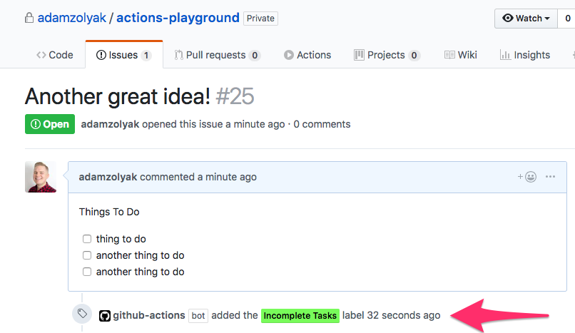
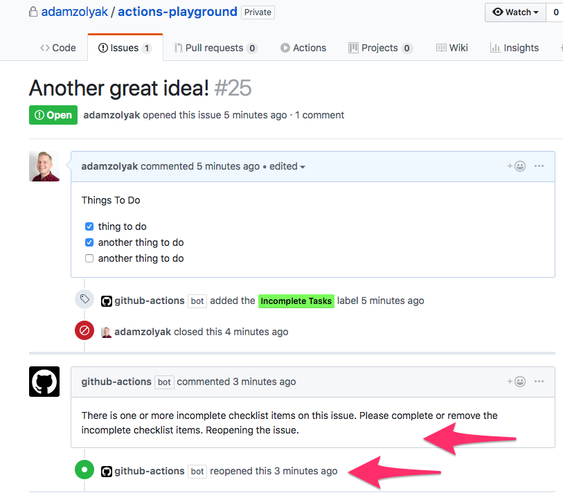

# ✅ Checklist Checker - GitHub Action

A [GitHub Action](https://github.com/features/actions) that makes sure checklists are completed before closing issues 📝.

## How It Works

This GitHub Action runs when an [`issues` event webhook](https://developer.github.com/v3/activity/events/types/#issuesevent) is fired in your GitHub repo. The action checks if there are incomplete checklist items `- [ ] to do` in markdown in the issue's description. If there is 1 or > incomplete checklist items, the action labels the issue with "Incomplete Items". Also, if the issue is closed with incomplete checklist items, the action will reopen the issue and comment on the issue.

## Installation

To use this GitHub Action, you must have access to [GitHub Actions](https://github.com/features/actions). GitHub Actions are currently only available in private beta (you must [apply for access](https://github.com/features/actions)) and only work in private repos.

To setup this action:

1. Create a `.github/main.workflow` in your GitHub repo.
2. Add the following code to the `main.workflow` file and commit it to the repo's `master` branch.

```
workflow "Issue Checklist Checker" {
  resolves = ["Check Checklist"]
  on = "issues"
}

action "Check Checklist" {
  uses = "adamzolyak/checklist-checker-action@master"
  secrets = ["GITHUB_TOKEN"]
}
```

3. Whenever you create, update, close, or reopen an issue, the action will run!

## Examples

Example of issue with incomplete checklist items in the description labeled with "Incomplete Tasks" label:


Example of re-opened issue with incomplete checklist items in the description labeled with "Incomplete Tasks" label:


## Contributing

If you have suggestions for how this GitHub ACtion could be improved, or want to report a bug, open an issue! Or pull request! We'd love all and any contributions. For more, check out the [Contributing Guide](CONTRIBUTING.md).

## License

[ISC](LICENSE) © 2018 Adam Zolyak <adam@tinkurlab.com> (www.tinkurlab.com)
